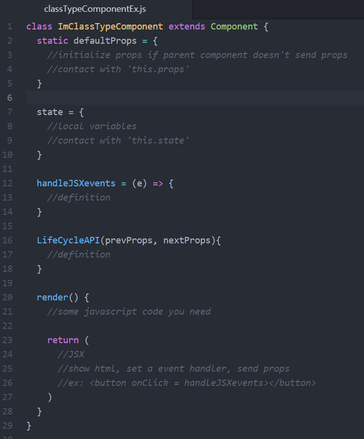
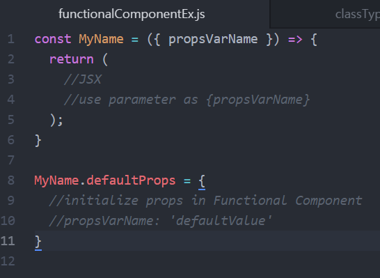

# React Practice(props and state)
Simple example of 'how to use props and state with eventHandler'

## Characteristic
- props
1.부모컴포넌트가 자식컴포넌트에게 전달해주는 값 
2.자식컴포넌트는 props를 받아오기만 하고, 직접 수정할 수는 없다(정적 데이터). 
3.this.props로 조회 가능하다. 

- state
1.컴포넌트 내부에서 선언한다. 
2.컴포넌트 내부에서 값을 변경(동적 데이터)한다. 
3.classfiels 문법으로 this.setState 내부에서 state 값을 변경한다. 
4.this.setState가 호출되면 컴포넌트가 리렌더링 된다. 
5.setState는 객체로 전달되는 값만 업데이트 해준다.

## Class type Component vs Functional Component
- Class type Component: normal case when component needs state, props, eventHandler, or LifeCylceAPI

  

- Functional Component: use when component is made only for shows props

  

## Reference
React tutorial - Velopert Blog [누구든지 하는 리액트 4편: props와 state](https://velopert.com/3629)
