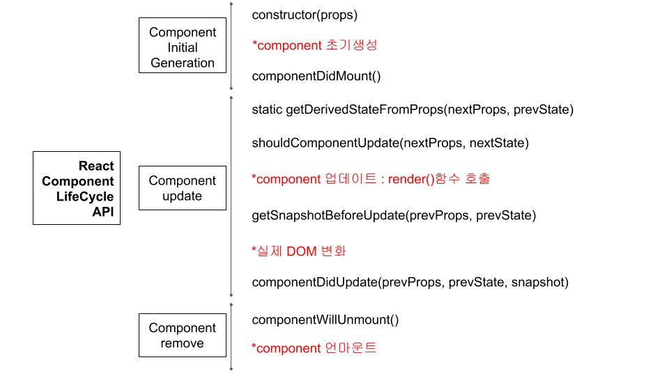
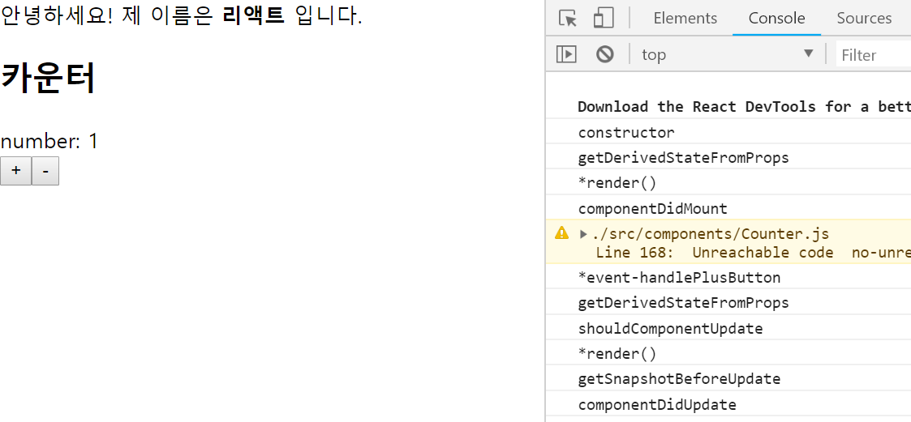
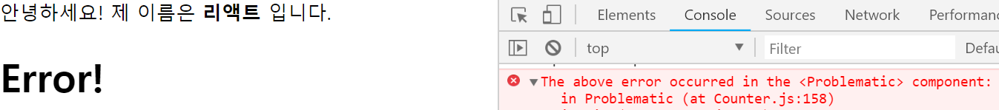

# React Practice(props and state, LifeCycle API, error handling)
- Simple example of 'how to use props and state with eventHandler'
- Sequence of component LifeCycle API with console.log
- Child component error catch via componentDidCatch API

## Characteristic of props and state
- props 
1. Variable that parent component send to child component 
2. (Static data)Child component cannot modify props directly but just take it 
3. Contact to variables via 'this.props' 

- state 
1. Define it inside of component, locally 
2. (Dynamic data)Can change it inside the component 
3. classfiels: state can changed inside this.setState 
4. Component is rerendered when this.setState is called 
5. Only can update state with 'this.setState' only when a variable is an ojbect type.

## LifeCycle API
- Generation sequence of component LifeCycle API 

  

- console log of initial generation and plus button action 

  

## error handling
 - Component cannot catch an error of itself, but can only when error is generated from child component.
 - API: componentDidCatch(err, info) 
 

  

## (ref)Class type Component vs Functional Component
- Class type Component: normal case when a component needs to use state, props, eventHandler, or LifeCylceAPI

  

- Functional Component: use when component is made only for shows props

  

## Reference
React tutorial - Velopert Blog [누구든지 하는 리액트 4편: props와 state](https://velopert.com/3629)
